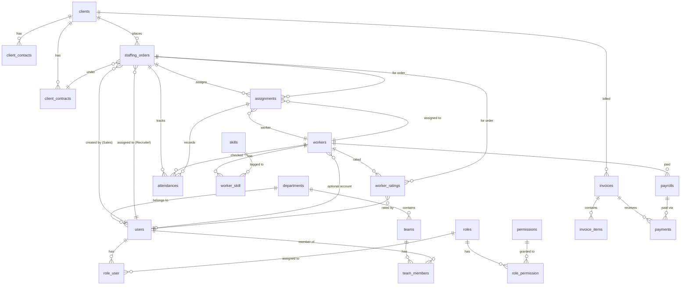

# Database Schema Design - He Thong Cung Ung Nhan Su Thoi Vu

> **Phien ban:** 2.0
> **Ngay cap nhat:** 2026-04-08
> **Tac gia:** System Architect
> **Database:** PostgreSQL 15+

---

## 1. Tong Quan

### 1.1 Nguyen tac thiet ke

| # | Nguyen tac | Mo ta |
|---|-----------|-------|
| 1 | UUID primary keys | Moi bang su dung UUID lam primary key, san sang cho multi-tenant va distributed systems |
| 2 | Soft deletes | Cac bang quan trong su dung `deleted_at` de giu lich su, khong xoa cung |
| 3 | Audit trail | Moi bang co `created_at`, `updated_at`. Cac bang nghiep vu co `created_by`, `updated_by` |
| 4 | Index strategy | Index cho foreign keys, cac truong filter/search thuong dung, composite index cho queries phuc tap |
| 5 | JSON columns | Su dung `jsonb` cho du lieu linh hoat (skills, requirements, metadata) |
| 6 | Enum bang code | Trang thai luu dang string ngan, map voi PHP Enum de dam bao type safety |
| 7 | Decimal cho tien | Dung `decimal(15,2)` cho cac truong tien te, tranh sai so float |
| 8 | Timestamps | Tat ca timestamps su dung `timestampTz` (co timezone) |

### 1.2 Phan loai bang

| Phan loai | Bang | Ghi chu |
|-----------|------|---------|
| **GIU NGUYEN** | users, password_reset_tokens, sessions, roles, permissions, role_permission, role_user, departments, teams, team_members, activity_logs, notifications, personal_access_tokens, cache | Da phu hop voi mo hinh moi |
| **GIU + SUA** | users (them truong), worker_skills (doi reference) | Can bo sung truong cho mo hinh nhan su thoi vu |
| **TAO MOI** | clients, client_contacts, client_contracts, staffing_orders, workers, skills, worker_skill (pivot), assignments, attendances (redesign), payrolls (redesign), invoices, invoice_items, payments, worker_ratings, categories | Bang moi cho nghiep vu cung ung nhan su |
| **XOA** | employers, dormitories, rooms, beds, room_contracts, room_invoices, interviews, job_posts, applications, labor_contracts, reviews, worker_profiles, worker_skills (cu), regions, enhance_worker_profiles, enhance_employers | Mo hinh cu (job board + nha tro) |

---

## 2. Entity Relationship Diagram (Mermaid)



---

## 3. Chi Tiet Tung Bang

### 3.1 Bang GIU NGUYEN (Khong thay doi)

#### users (sua - them truong)

Bang `users` hien tai da co cau truc co ban. Can **them** cac truong sau de ho tro nghiep vu moi:

| Column | Type | Constraint | Mo ta | Thay doi |
|--------|------|-----------|-------|----------|
| id | uuid | PK | | Giu |
| name | varchar(255) | NOT NULL | Ho ten | Giu |
| email | varchar(255) | UNIQUE, NULLABLE | Email | Giu |
| phone | varchar(15) | UNIQUE, NULLABLE | So dien thoai | Giu |
| email_verified_at | timestampTz | NULLABLE | | Giu |
| password | varchar(255) | NOT NULL | | Giu |
| role | varchar(20) | DEFAULT 'staff' | Role mac dinh (de phan biet nhanh, chi tiet dung RBAC) | **Sua default** |
| status | varchar(20) | DEFAULT 'active' | Trang thai tai khoan | **Sua default** |
| avatar_url | varchar(500) | NULLABLE | Anh dai dien | Giu |
| department_id | uuid | FK -> departments, NULLABLE | Phong ban | Giu |
| team_id | uuid | FK -> teams, NULLABLE | Team | Giu |
| position | varchar(100) | NULLABLE | Chuc vu | Giu |
| phone_ext | varchar(10) | NULLABLE | So may nhanh | Giu |
| employee_code | varchar(30) | UNIQUE, NULLABLE | Ma nhan vien | Giu |
| hire_date | date | NULLABLE | Ngay vao lam | Giu |
| is_active | boolean | DEFAULT true | Trang thai hoat dong | Giu |
| managed_districts | jsonb | NULLABLE | Khu vuc phu trach (Recruiter) | **Them moi** |
| kpi_target | jsonb | NULLABLE | Chi tieu KPI theo thang | **Them moi** |
| last_login_at | timestampTz | NULLABLE | | Giu |
| remember_token | varchar(100) | NULLABLE | | Giu |
| created_at | timestampTz | | | Giu |
| updated_at | timestampTz | | | Giu |

**Truong xoa:** `credit_score` (khong con phu hop voi mo hinh moi)

**Index moi:**
- `idx_users_department_id` ON (department_id)
- `idx_users_is_active` ON (is_active)
- `idx_users_role` ON (role)

#### roles, permissions, role_permission, role_user
Giu nguyen hoan toan. Da du linh hoat cho RBAC.

#### departments, teams, team_members
Giu nguyen hoan toan.

#### activity_logs
Giu nguyen hoan toan. Dung cho audit trail toan he thong.

#### notifications
Giu nguyen hoan toan.

#### personal_access_tokens, cache, sessions, password_reset_tokens
Giu nguyen hoan toan (Laravel system tables).

---

### 3.2 Bang TAO MOI

#### 3.2.1 clients - Khach hang (doanh nghiep)

| Column | Type | Constraint | Mo ta |
|--------|------|-----------|-------|
| id | uuid | PK | |
| company_name | varchar(255) | NOT NULL | Ten cong ty |
| tax_code | varchar(20) | UNIQUE, NULLABLE | Ma so thue |
| industry | varchar(100) | NULLABLE | Nganh nghe (san xuat, dich vu, xay dung...) |
| company_size | varchar(20) | NULLABLE | Quy mo: small / medium / large |
| address | text | NULLABLE | Dia chi tru so |
| district | varchar(100) | NULLABLE | Quan/Huyen |
| city | varchar(100) | NULLABLE | Tinh/Thanh pho |
| contact_name | varchar(255) | NULLABLE | Nguoi lien he chinh (shortcut) |
| contact_phone | varchar(15) | NULLABLE | SDT lien he chinh |
| contact_email | varchar(255) | NULLABLE | Email lien he chinh |
| website | varchar(500) | NULLABLE | Website cong ty |
| status | varchar(20) | NOT NULL, DEFAULT 'prospect' | prospect / active / inactive |
| notes | text | NULLABLE | Ghi chu noi bo |
| created_by | uuid | FK -> users, NULLABLE | Nguoi tao (Sales) |
| created_at | timestampTz | | |
| updated_at | timestampTz | | |
| deleted_at | timestampTz | NULLABLE | Soft delete |

**Indexes:**
- `idx_clients_status` ON (status)
- `idx_clients_city` ON (city)
- `idx_clients_industry` ON (industry)
- `idx_clients_created_by` ON (created_by)
- `idx_clients_tax_code` ON (tax_code)
- `idx_clients_company_name_search` GIN (to_tsvector('simple', company_name)) -- full text search

---

#### 3.2.2 client_contacts - Lien he cua khach hang

| Column | Type | Constraint | Mo ta |
|--------|------|-----------|-------|
| id | uuid | PK | |
| client_id | uuid | FK -> clients, NOT NULL | Khach hang |
| name | varchar(255) | NOT NULL | Ho ten nguoi lien he |
| position | varchar(100) | NULLABLE | Chuc vu |
| phone | varchar(15) | NULLABLE | SDT |
| email | varchar(255) | NULLABLE | Email |
| is_primary | boolean | DEFAULT false | La lien he chinh? |
| notes | text | NULLABLE | Ghi chu |
| created_at | timestampTz | | |
| updated_at | timestampTz | | |

**Indexes:**
- `idx_client_contacts_client_id` ON (client_id)

---

#### 3.2.3 client_contracts - Hop dong voi khach hang

| Column | Type | Constraint | Mo ta |
|--------|------|-----------|-------|
| id | uuid | PK | |
| client_id | uuid | FK -> clients, NOT NULL | Khach hang |
| contract_number | varchar(50) | UNIQUE, NOT NULL | So hop dong |
| type | varchar(20) | NOT NULL, DEFAULT 'framework' | framework (khung) / per_order (theo don) |
| start_date | date | NOT NULL | Ngay bat dau hieu luc |
| end_date | date | NULLABLE | Ngay ket thuc |
| markup_percentage | decimal(5,2) | NULLABLE | % markup mac dinh |
| payment_terms | smallint | DEFAULT 30 | So ngay thanh toan (7/15/30) |
| value | decimal(15,2) | NULLABLE | Gia tri hop dong (neu co) |
| status | varchar(20) | NOT NULL, DEFAULT 'draft' | draft / active / expired / terminated |
| file_url | varchar(500) | NULLABLE | File hop dong scan (S3 path) |
| notes | text | NULLABLE | Ghi chu |
| approved_by | uuid | FK -> users, NULLABLE | Nguoi duyet |
| approved_at | timestampTz | NULLABLE | Thoi gian duyet |
| created_by | uuid | FK -> users, NULLABLE | Nguoi tao |
| created_at | timestampTz | | |
| updated_at | timestampTz | | |
| deleted_at | timestampTz | NULLABLE | Soft delete |

**Indexes:**
- `idx_client_contracts_client_id` ON (client_id)
- `idx_client_contracts_status` ON (status)
- `idx_client_contracts_dates` ON (start_date, end_date)

---

#### 3.2.4 staffing_orders - Don hang nhan su

Day la bang **quan trong nhat**, thay the `job_posts` trong mo hinh cu.

| Column | Type | Constraint | Mo ta |
|--------|------|-----------|-------|
| id | uuid | PK | |
| order_code | varchar(20) | UNIQUE, NOT NULL | Ma don hang (auto: DH-YYYYMMDD-XXX) |
| client_id | uuid | FK -> clients, NOT NULL | Khach hang dat don |
| client_contact_id | uuid | FK -> client_contacts, NULLABLE | Nguoi yeu cau tu phia khach hang |
| contract_id | uuid | FK -> client_contracts, NULLABLE | Hop dong lien ket (neu co) |
| | | | |
| **-- Thong tin cong viec --** | | | |
| position_name | varchar(255) | NOT NULL | Ten vi tri (VD: "Cong nhan boc xep") |
| job_description | text | NULLABLE | Mo ta cong viec chi tiet |
| work_address | text | NULLABLE | Dia chi lam viec |
| work_district | varchar(100) | NULLABLE | Quan/Huyen |
| work_city | varchar(100) | NULLABLE | Tinh/Thanh pho |
| | | | |
| **-- So luong & yeu cau --** | | | |
| quantity_needed | smallint | NOT NULL | So workers can |
| quantity_filled | smallint | NOT NULL, DEFAULT 0 | So da dap ung (auto update) |
| gender_requirement | varchar(10) | NULLABLE | male / female / any |
| age_min | smallint | NULLABLE | Tuoi toi thieu |
| age_max | smallint | NULLABLE | Tuoi toi da |
| required_skills | jsonb | NULLABLE | Danh sach ky nang yeu cau [{skill_id, skill_name}] |
| other_requirements | text | NULLABLE | Yeu cau khac (text tu do) |
| | | | |
| **-- Thoi gian --** | | | |
| start_date | date | NOT NULL | Ngay bat dau lam |
| end_date | date | NULLABLE | Ngay ket thuc (null = chua xac dinh) |
| shift_type | varchar(20) | NULLABLE | morning / afternoon / evening / double / continuous |
| start_time | time | NULLABLE | Gio bat dau ca |
| end_time | time | NULLABLE | Gio ket thuc ca |
| break_minutes | smallint | DEFAULT 0 | Thoi gian nghi (phut) |
| | | | |
| **-- Tai chinh --** | | | |
| worker_rate | decimal(12,0) | NULLABLE | Don gia tra worker (VND) |
| rate_type | varchar(10) | DEFAULT 'daily' | hourly / daily / shift |
| service_fee | decimal(12,0) | NULLABLE | Phi dich vu tinh cho khach |
| service_fee_type | varchar(10) | DEFAULT 'percent' | percent / fixed |
| overtime_rate | decimal(12,0) | NULLABLE | Don gia tang ca |
| | | | |
| **-- Quan ly --** | | | |
| urgency | varchar(10) | NOT NULL, DEFAULT 'normal' | normal / urgent / critical |
| service_type | varchar(20) | NOT NULL, DEFAULT 'short_term' | short_term / long_term / shift_based / project_based |
| status | varchar(20) | NOT NULL, DEFAULT 'draft' | draft / pending / approved / rejected / recruiting / filled / in_progress / completed / cancelled |
| assigned_recruiter_id | uuid | FK -> users, NULLABLE | Recruiter duoc phan cong |
| created_by | uuid | FK -> users, NULLABLE | Nguoi tao (Sales) |
| approved_by | uuid | FK -> users, NULLABLE | Nguoi duyet (Manager) |
| approved_at | timestampTz | NULLABLE | Thoi gian duyet |
| rejection_reason | text | NULLABLE | Ly do tu choi |
| cancellation_reason | text | NULLABLE | Ly do huy |
| notes | text | NULLABLE | Ghi chu noi bo |
| created_at | timestampTz | | |
| updated_at | timestampTz | | |
| deleted_at | timestampTz | NULLABLE | Soft delete |

**Indexes:**
- `idx_staffing_orders_client_id` ON (client_id)
- `idx_staffing_orders_status` ON (status)
- `idx_staffing_orders_urgency` ON (urgency)
- `idx_staffing_orders_assigned_recruiter_id` ON (assigned_recruiter_id)
- `idx_staffing_orders_created_by` ON (created_by)
- `idx_staffing_orders_dates` ON (start_date, end_date)
- `idx_staffing_orders_work_city` ON (work_city)
- `idx_staffing_orders_order_code` ON (order_code)
- `idx_staffing_orders_status_urgency` ON (status, urgency) -- composite cho filter

---

#### 3.2.5 workers - Lao dong thoi vu

Thay the `worker_profiles`. Workers co the co hoac khong co tai khoan user tren he thong.

| Column | Type | Constraint | Mo ta |
|--------|------|-----------|-------|
| id | uuid | PK | |
| worker_code | varchar(20) | UNIQUE, NOT NULL | Ma worker (auto: WK-XXXXX) |
| user_id | uuid | FK -> users, NULLABLE, UNIQUE | Tai khoan user (neu co) |
| | | | |
| **-- Thong tin ca nhan --** | | | |
| full_name | varchar(255) | NOT NULL | Ho ten day du |
| date_of_birth | date | NULLABLE | Ngay sinh |
| gender | varchar(10) | NULLABLE | male / female |
| id_number | varchar(20) | UNIQUE, NULLABLE | So CCCD/CMND |
| id_card_front_url | varchar(500) | NULLABLE | Anh CCCD mat truoc |
| id_card_back_url | varchar(500) | NULLABLE | Anh CCCD mat sau |
| phone | varchar(15) | NOT NULL | SDT (bat buoc) |
| email | varchar(255) | NULLABLE | Email |
| address | text | NULLABLE | Dia chi hien tai |
| district | varchar(100) | NULLABLE | Quan/Huyen |
| city | varchar(100) | NULLABLE | Tinh/Thanh pho |
| avatar_url | varchar(500) | NULLABLE | Anh chan dung |
| | | | |
| **-- Thong tin lao dong --** | | | |
| experience_notes | text | NULLABLE | Mo ta kinh nghiem |
| preferred_districts | jsonb | NULLABLE | Khu vuc muon lam viec ["Quan 1", "Quan 7"] |
| availability | varchar(20) | DEFAULT 'full_time' | full_time / part_time / weekends_only |
| | | | |
| **-- Thong tin ngan hang --** | | | |
| bank_name | varchar(100) | NULLABLE | Ten ngan hang |
| bank_account | varchar(30) | NULLABLE | So tai khoan |
| bank_account_name | varchar(255) | NULLABLE | Chu tai khoan |
| | | | |
| **-- Thong ke (auto-calculated) --** | | | |
| total_orders | int | DEFAULT 0 | Tong so don hang da tham gia |
| total_days_worked | int | DEFAULT 0 | Tong ngay da lam |
| average_rating | decimal(2,1) | DEFAULT 0 | Diem danh gia trung binh (1-5) |
| no_show_count | int | DEFAULT 0 | So lan no-show |
| last_worked_date | date | NULLABLE | Ngay lam viec gan nhat |
| | | | |
| **-- Trang thai --** | | | |
| status | varchar(20) | NOT NULL, DEFAULT 'available' | available / assigned / inactive / blacklisted |
| blacklist_reason | text | NULLABLE | Ly do blacklist |
| registered_by | uuid | FK -> users, NULLABLE | Recruiter dang ky worker |
| notes | text | NULLABLE | Ghi chu noi bo |
| emergency_contact_name | varchar(255) | NULLABLE | Nguoi lien he khan cap |
| emergency_contact_phone | varchar(15) | NULLABLE | SDT lien he khan cap |
| created_at | timestampTz | | |
| updated_at | timestampTz | | |
| deleted_at | timestampTz | NULLABLE | Soft delete |

**Indexes:**
- `idx_workers_status` ON (status)
- `idx_workers_city` ON (city)
- `idx_workers_district` ON (district)
- `idx_workers_phone` ON (phone)
- `idx_workers_id_number` ON (id_number)
- `idx_workers_user_id` ON (user_id)
- `idx_workers_registered_by` ON (registered_by)
- `idx_workers_average_rating` ON (average_rating)
- `idx_workers_availability` ON (availability)
- `idx_workers_last_worked_date` ON (last_worked_date)
- `idx_workers_fullname_search` GIN (to_tsvector('simple', full_name)) -- full text search

---

#### 3.2.6 skills - Danh muc ky nang

| Column | Type | Constraint | Mo ta |
|--------|------|-----------|-------|
| id | uuid | PK | |
| name | varchar(100) | NOT NULL | Ten ky nang (VD: "Boc xep", "Phu ban") |
| category | varchar(50) | NULLABLE | Nhom ky nang (VD: "Lao dong pho thong", "Dich vu") |
| description | text | NULLABLE | Mo ta chi tiet |
| is_active | boolean | DEFAULT true | Con su dung? |
| sort_order | smallint | DEFAULT 0 | Thu tu hien thi |
| created_at | timestampTz | | |
| updated_at | timestampTz | | |

**Indexes:**
- `idx_skills_category` ON (category)
- `idx_skills_is_active` ON (is_active)
- `unique_skills_name` UNIQUE ON (name)

---

#### 3.2.7 worker_skill - Pivot table (Worker - Skill)

| Column | Type | Constraint | Mo ta |
|--------|------|-----------|-------|
| worker_id | uuid | FK -> workers, NOT NULL | |
| skill_id | uuid | FK -> skills, NOT NULL | |
| level | varchar(20) | DEFAULT 'intermediate' | beginner / intermediate / advanced |
| years_experience | decimal(3,1) | NULLABLE | So nam kinh nghiem |
| created_at | timestampTz | | |

**Primary Key:** (worker_id, skill_id)

---

#### 3.2.8 assignments - Phan cong worker vao don hang

Thay the `applications` trong mo hinh cu. Day la bang lien ket giua `staffing_orders` va `workers`.

| Column | Type | Constraint | Mo ta |
|--------|------|-----------|-------|
| id | uuid | PK | |
| order_id | uuid | FK -> staffing_orders, NOT NULL | Don hang |
| worker_id | uuid | FK -> workers, NOT NULL | Worker duoc phan cong |
| assigned_by | uuid | FK -> users, NOT NULL | Recruiter phan cong |
| | | | |
| **-- Trang thai --** | | | |
| status | varchar(20) | NOT NULL, DEFAULT 'created' | created / contacted / confirmed / working / completed / rejected / cancelled / no_contact / replaced |
| confirmation_note | text | NULLABLE | Ghi chu khi xac nhan |
| rejection_reason | text | NULLABLE | Ly do tu choi |
| | | | |
| **-- Dieu phoi --** | | | |
| dispatch_info | text | NULLABLE | Thong tin gui worker (dia diem, gio, lien he) |
| is_reconfirmed | boolean | DEFAULT false | Da re-confirm truoc ngay lam? |
| reconfirmed_at | timestampTz | NULLABLE | Thoi gian re-confirm |
| | | | |
| **-- Thay the --** | | | |
| replaced_by_id | uuid | FK -> assignments (self), NULLABLE | Assignment moi thay the |
| replacement_reason | text | NULLABLE | Ly do thay the |
| | | | |
| **-- Timestamps --** | | | |
| confirmed_at | timestampTz | NULLABLE | Thoi gian worker xac nhan |
| started_at | timestampTz | NULLABLE | Thoi gian bat dau lam |
| completed_at | timestampTz | NULLABLE | Thoi gian hoan thanh |
| created_at | timestampTz | | |
| updated_at | timestampTz | | |

**Indexes:**
- `idx_assignments_order_id` ON (order_id)
- `idx_assignments_worker_id` ON (worker_id)
- `idx_assignments_status` ON (status)
- `idx_assignments_assigned_by` ON (assigned_by)
- `unique_assignments_order_worker` UNIQUE ON (order_id, worker_id) WHERE status NOT IN ('cancelled', 'replaced', 'rejected') -- Partial unique: 1 worker chi co 1 assignment active cho 1 don hang

---

#### 3.2.9 attendances - Cham cong (Redesign)

Thay the bang `attendances` cu (tham chieu `labor_contracts`). Bang moi tham chieu `assignments`.

| Column | Type | Constraint | Mo ta |
|--------|------|-----------|-------|
| id | uuid | PK | |
| assignment_id | uuid | FK -> assignments, NOT NULL | Phan cong lien quan |
| worker_id | uuid | FK -> workers, NOT NULL | Worker (denormalized de query nhanh) |
| order_id | uuid | FK -> staffing_orders, NOT NULL | Don hang (denormalized) |
| work_date | date | NOT NULL | Ngay lam viec |
| | | | |
| **-- Check in/out --** | | | |
| check_in_time | timestampTz | NULLABLE | Gio check-in |
| check_in_by | uuid | FK -> users, NULLABLE | Recruiter ghi nhan check-in |
| check_in_note | text | NULLABLE | Ghi chu check-in (tre, ...) |
| check_out_time | timestampTz | NULLABLE | Gio check-out |
| check_out_by | uuid | FK -> users, NULLABLE | Recruiter ghi nhan check-out |
| check_out_note | text | NULLABLE | Ghi chu check-out |
| | | | |
| **-- Tinh toan --** | | | |
| break_minutes | smallint | DEFAULT 0 | Thoi gian nghi (phut) |
| total_hours | decimal(4,1) | NULLABLE | Tong gio lam (auto) |
| overtime_hours | decimal(4,1) | DEFAULT 0 | Gio tang ca |
| status | varchar(20) | NOT NULL, DEFAULT 'present' | present / late / absent / half_day / excused |
| | | | |
| **-- Duyet --** | | | |
| is_approved | boolean | DEFAULT false | Da duyet? |
| approved_by | uuid | FK -> users, NULLABLE | Manager duyet |
| approved_at | timestampTz | NULLABLE | Thoi gian duyet |
| adjustment_reason | text | NULLABLE | Ly do chinh sua (neu co) |
| | | | |
| created_at | timestampTz | | |
| updated_at | timestampTz | | |

**Indexes:**
- `idx_attendances_assignment_id` ON (assignment_id)
- `idx_attendances_worker_id` ON (worker_id)
- `idx_attendances_order_id` ON (order_id)
- `idx_attendances_work_date` ON (work_date)
- `idx_attendances_status` ON (status)
- `idx_attendances_is_approved` ON (is_approved)
- `unique_attendances_assignment_date` UNIQUE ON (assignment_id, work_date) -- 1 record / assignment / ngay

---

#### 3.2.10 payrolls - Bang luong (Redesign)

Thay the bang `payrolls` cu. Khong con tham chieu `labor_contracts`, ma tham chieu `staffing_orders`.

| Column | Type | Constraint | Mo ta |
|--------|------|-----------|-------|
| id | uuid | PK | |
| payroll_code | varchar(20) | UNIQUE, NOT NULL | Ma bang luong (auto: PRL-YYYYMM-XXX) |
| worker_id | uuid | FK -> workers, NOT NULL | Worker |
| order_id | uuid | FK -> staffing_orders, NULLABLE | Don hang (nullable cho luong tong hop) |
| period_start | date | NOT NULL | Ky tu ngay |
| period_end | date | NOT NULL | Ky den ngay |
| | | | |
| **-- Chi tiet cong --** | | | |
| total_days | smallint | DEFAULT 0 | Tong ngay lam |
| total_hours | decimal(6,1) | DEFAULT 0 | Tong gio lam |
| overtime_hours | decimal(6,1) | DEFAULT 0 | Gio tang ca |
| | | | |
| **-- Chi tiet luong --** | | | |
| unit_price | decimal(12,0) | DEFAULT 0 | Don gia (VND/gio hoac VND/ngay) |
| rate_type | varchar(10) | DEFAULT 'daily' | hourly / daily / shift |
| base_amount | decimal(15,2) | DEFAULT 0 | Luong co ban |
| overtime_amount | decimal(15,2) | DEFAULT 0 | Luong tang ca |
| allowance_amount | decimal(15,2) | DEFAULT 0 | Phu cap |
| deduction_amount | decimal(15,2) | DEFAULT 0 | Khau tru |
| net_amount | decimal(15,2) | DEFAULT 0 | Thuc lanh |
| | | | |
| **-- Trang thai --** | | | |
| status | varchar(20) | NOT NULL, DEFAULT 'draft' | draft / reviewed / approved / paid |
| approved_by | uuid | FK -> users, NULLABLE | Nguoi duyet |
| approved_at | timestampTz | NULLABLE | Thoi gian duyet |
| paid_at | timestampTz | NULLABLE | Thoi gian tra |
| payment_method | varchar(20) | NULLABLE | cash / bank_transfer |
| payment_reference | varchar(100) | NULLABLE | Ma giao dich |
| notes | text | NULLABLE | Ghi chu |
| created_by | uuid | FK -> users, NULLABLE | Nguoi tao |
| created_at | timestampTz | | |
| updated_at | timestampTz | | |

**Indexes:**
- `idx_payrolls_worker_id` ON (worker_id)
- `idx_payrolls_order_id` ON (order_id)
- `idx_payrolls_status` ON (status)
- `idx_payrolls_period` ON (period_start, period_end)
- `idx_payrolls_paid_at` ON (paid_at)

---

#### 3.2.11 invoices - Hoa don cho khach hang

| Column | Type | Constraint | Mo ta |
|--------|------|-----------|-------|
| id | uuid | PK | |
| invoice_number | varchar(20) | UNIQUE, NOT NULL | So hoa don (auto: INV-YYYYMM-XXX) |
| client_id | uuid | FK -> clients, NOT NULL | Khach hang |
| period_start | date | NOT NULL | Ky tu ngay |
| period_end | date | NOT NULL | Ky den ngay |
| | | | |
| **-- So tien --** | | | |
| subtotal | decimal(15,2) | NOT NULL, DEFAULT 0 | Tong truoc thue |
| tax_rate | decimal(4,2) | DEFAULT 0 | Thue suat (% VD: 10.00) |
| tax_amount | decimal(15,2) | DEFAULT 0 | Tien thue |
| total_amount | decimal(15,2) | NOT NULL, DEFAULT 0 | Tong sau thue |
| | | | |
| **-- Thanh toan --** | | | |
| status | varchar(20) | NOT NULL, DEFAULT 'draft' | draft / approved / sent / partially_paid / paid / overdue / cancelled |
| due_date | date | NULLABLE | Han thanh toan |
| paid_amount | decimal(15,2) | DEFAULT 0 | So da thanh toan |
| | | | |
| **-- Quan ly --** | | | |
| approved_by | uuid | FK -> users, NULLABLE | Nguoi duyet |
| approved_at | timestampTz | NULLABLE | |
| sent_at | timestampTz | NULLABLE | Ngay gui cho khach |
| notes | text | NULLABLE | Ghi chu |
| created_by | uuid | FK -> users, NULLABLE | Nguoi tao |
| created_at | timestampTz | | |
| updated_at | timestampTz | | |
| deleted_at | timestampTz | NULLABLE | Soft delete |

**Indexes:**
- `idx_invoices_client_id` ON (client_id)
- `idx_invoices_status` ON (status)
- `idx_invoices_due_date` ON (due_date)
- `idx_invoices_period` ON (period_start, period_end)

---

#### 3.2.12 invoice_items - Chi tiet hoa don

| Column | Type | Constraint | Mo ta |
|--------|------|-----------|-------|
| id | uuid | PK | |
| invoice_id | uuid | FK -> invoices, NOT NULL | Hoa don |
| order_id | uuid | FK -> staffing_orders, NULLABLE | Don hang lien quan |
| description | varchar(500) | NOT NULL | Mo ta (ten don hang, vi tri, ky) |
| quantity | decimal(10,2) | NOT NULL | So luong (gio/cong/ngay) |
| unit | varchar(20) | DEFAULT 'day' | hour / day / shift / person |
| unit_price | decimal(12,0) | NOT NULL | Don gia |
| amount | decimal(15,2) | NOT NULL | Thanh tien |
| created_at | timestampTz | | |
| updated_at | timestampTz | | |

**Indexes:**
- `idx_invoice_items_invoice_id` ON (invoice_id)
- `idx_invoice_items_order_id` ON (order_id)

---

#### 3.2.13 payments - Lich su thanh toan

Bang polymorphic - ghi nhan thanh toan cho ca invoices (khach tra) va payrolls (tra luong workers).

| Column | Type | Constraint | Mo ta |
|--------|------|-----------|-------|
| id | uuid | PK | |
| payable_type | varchar(50) | NOT NULL | 'invoice' hoac 'payroll' |
| payable_id | uuid | NOT NULL | ID cua invoice hoac payroll |
| amount | decimal(15,2) | NOT NULL | So tien |
| payment_method | varchar(20) | NOT NULL | bank_transfer / cash / check |
| payment_date | date | NOT NULL | Ngay thanh toan |
| reference_number | varchar(100) | NULLABLE | Ma giao dich ngan hang |
| notes | text | NULLABLE | Ghi chu |
| recorded_by | uuid | FK -> users, NULLABLE | Nguoi ghi nhan |
| created_at | timestampTz | | |
| updated_at | timestampTz | | |

**Indexes:**
- `idx_payments_payable` ON (payable_type, payable_id)
- `idx_payments_payment_date` ON (payment_date)
- `idx_payments_recorded_by` ON (recorded_by)

---

#### 3.2.14 worker_ratings - Danh gia worker sau moi don hang

| Column | Type | Constraint | Mo ta |
|--------|------|-----------|-------|
| id | uuid | PK | |
| worker_id | uuid | FK -> workers, NOT NULL | Worker duoc danh gia |
| order_id | uuid | FK -> staffing_orders, NOT NULL | Don hang |
| rated_by | uuid | FK -> users, NOT NULL | Recruiter danh gia |
| overall_score | smallint | NOT NULL, CHECK (1-5) | Diem tong (1-5) |
| punctuality | smallint | NULLABLE, CHECK (1-5) | Dung gio |
| skill_level | smallint | NULLABLE, CHECK (1-5) | Ky nang |
| attitude | smallint | NULLABLE, CHECK (1-5) | Thai do |
| diligence | smallint | NULLABLE, CHECK (1-5) | Cham chi |
| comment | text | NULLABLE | Nhan xet |
| created_at | timestampTz | | |

**Indexes:**
- `idx_worker_ratings_worker_id` ON (worker_id)
- `idx_worker_ratings_order_id` ON (order_id)
- `unique_worker_ratings_worker_order` UNIQUE ON (worker_id, order_id) -- 1 danh gia / worker / don hang

---

#### 3.2.15 categories - Danh muc he thong (da nang)

| Column | Type | Constraint | Mo ta |
|--------|------|-----------|-------|
| id | uuid | PK | |
| type | varchar(50) | NOT NULL | Loai danh muc: shift_type, district, industry, cancellation_reason... |
| name | varchar(255) | NOT NULL | Ten danh muc |
| code | varchar(50) | NULLABLE | Ma danh muc |
| parent_id | uuid | FK -> categories (self), NULLABLE | Danh muc cha (ho tro cap bac) |
| metadata | jsonb | NULLABLE | Du lieu bo sung |
| sort_order | smallint | DEFAULT 0 | Thu tu |
| is_active | boolean | DEFAULT true | Con su dung? |
| created_at | timestampTz | | |
| updated_at | timestampTz | | |

**Indexes:**
- `idx_categories_type` ON (type)
- `idx_categories_parent_id` ON (parent_id)
- `idx_categories_is_active` ON (is_active)
- `unique_categories_type_code` UNIQUE ON (type, code) WHERE code IS NOT NULL

---

## 4. Bang XOA (Mo Hinh Cu)

Cac bang sau se bi xoa vi thuoc mo hinh job board + nha tro, khong con phu hop:

| Bang | Ly do xoa | Du lieu migrate sang |
|------|-----------|---------------------|
| `employers` | Thay bang `clients` + `client_contacts` | company_name, industry, address -> clients |
| `dormitories` | Khong con module nha tro | Khong migrate |
| `rooms` | Khong con module nha tro | Khong migrate |
| `beds` | Khong con module nha tro | Khong migrate |
| `room_contracts` | Khong con module nha tro | Khong migrate |
| `room_invoices` | Khong con module nha tro | Khong migrate |
| `interviews` | Khong con quy trinh phong van | Khong migrate |
| `job_posts` | Thay bang `staffing_orders` | title, description, positions_count -> staffing_orders |
| `applications` | Thay bang `assignments` | job_post_id, worker -> assignments |
| `labor_contracts` | Khong con hop dong lao dong truc tiep | Khong migrate |
| `reviews` | Thay bang `worker_ratings` | rating data -> worker_ratings |
| `worker_profiles` | Thay bang `workers` | Toan bo thong tin -> workers |
| `worker_skills` (cu) | Thay bang `worker_skill` + `skills` | Migrate sang worker_skill pivot |
| `regions` | Thay bang truong district/city tren tung bang | Khong can bang rieng |
| `task_assignments` | **Giu hoac xoa tuy nhu cau** | Co the giu de quan ly task noi bo |
| `task_comments` | Di kem task_assignments | |

> **Ghi chu ve task_assignments**: Bang nay co the giu lai neu can quan ly tasks noi bo (VD: "Xac minh worker", "Gui hop dong"). Tuy nhien, workflow chinh cua don hang da duoc quan ly qua `staffing_orders.status` va `assignments`. Quyet dinh giu hay xoa tuy vao nhu cau cu the.

---

## 5. Quan He Giua Cac Bang (Foreign Keys)

```
clients
  |-- client_contacts (client_id)
  |-- client_contracts (client_id)
  |-- staffing_orders (client_id)
  |-- invoices (client_id)

staffing_orders
  |-- assignments (order_id)
  |-- attendances (order_id)
  |-- invoice_items (order_id)
  |-- worker_ratings (order_id)
  |-- payrolls (order_id)
  |
  |-> client_contacts (client_contact_id)
  |-> client_contracts (contract_id)
  |-> users (assigned_recruiter_id, created_by, approved_by)

workers
  |-- worker_skill (worker_id)
  |-- assignments (worker_id)
  |-- attendances (worker_id)
  |-- payrolls (worker_id)
  |-- worker_ratings (worker_id)
  |
  |-> users (user_id) -- optional

assignments
  |-- attendances (assignment_id)
  |
  |-> staffing_orders (order_id)
  |-> workers (worker_id)
  |-> users (assigned_by)
  |-> assignments (replaced_by_id) -- self-reference

invoices
  |-- invoice_items (invoice_id)
  |-- payments (payable_type='invoice', payable_id)
  |
  |-> clients (client_id)

payrolls
  |-- payments (payable_type='payroll', payable_id)
  |
  |-> workers (worker_id)
  |-> staffing_orders (order_id)
```

---

## 6. Enum Definitions (PHP)

Cac enum tuong ung voi cac truong status trong database:

```php
// app/Enums/ClientStatus.php
enum ClientStatus: string {
    case Prospect = 'prospect';
    case Active = 'active';
    case Inactive = 'inactive';
}

// app/Enums/ContractStatus.php
enum ContractStatus: string {
    case Draft = 'draft';
    case Active = 'active';
    case Expired = 'expired';
    case Terminated = 'terminated';
}

// app/Enums/OrderStatus.php
enum OrderStatus: string {
    case Draft = 'draft';
    case Pending = 'pending';
    case Approved = 'approved';
    case Rejected = 'rejected';
    case Recruiting = 'recruiting';
    case Filled = 'filled';
    case InProgress = 'in_progress';
    case Completed = 'completed';
    case Cancelled = 'cancelled';
}

// app/Enums/OrderUrgency.php
enum OrderUrgency: string {
    case Normal = 'normal';
    case Urgent = 'urgent';
    case Critical = 'critical';
}

// app/Enums/ServiceType.php
enum ServiceType: string {
    case ShortTerm = 'short_term';
    case LongTerm = 'long_term';
    case ShiftBased = 'shift_based';
    case ProjectBased = 'project_based';
}

// app/Enums/WorkerStatus.php
enum WorkerStatus: string {
    case Available = 'available';
    case Assigned = 'assigned';
    case Inactive = 'inactive';
    case Blacklisted = 'blacklisted';
}

// app/Enums/AssignmentStatus.php
enum AssignmentStatus: string {
    case Created = 'created';
    case Contacted = 'contacted';
    case Confirmed = 'confirmed';
    case Working = 'working';
    case Completed = 'completed';
    case Rejected = 'rejected';
    case Cancelled = 'cancelled';
    case NoContact = 'no_contact';
    case Replaced = 'replaced';
}

// app/Enums/AttendanceStatus.php
enum AttendanceStatus: string {
    case Present = 'present';
    case Late = 'late';
    case Absent = 'absent';
    case HalfDay = 'half_day';
    case Excused = 'excused';
}

// app/Enums/PayrollStatus.php
enum PayrollStatus: string {
    case Draft = 'draft';
    case Reviewed = 'reviewed';
    case Approved = 'approved';
    case Paid = 'paid';
}

// app/Enums/InvoiceStatus.php
enum InvoiceStatus: string {
    case Draft = 'draft';
    case Approved = 'approved';
    case Sent = 'sent';
    case PartiallyPaid = 'partially_paid';
    case Paid = 'paid';
    case Overdue = 'overdue';
    case Cancelled = 'cancelled';
}

// app/Enums/PaymentMethod.php
enum PaymentMethod: string {
    case BankTransfer = 'bank_transfer';
    case Cash = 'cash';
    case Check = 'check';
}

// app/Enums/RateType.php
enum RateType: string {
    case Hourly = 'hourly';
    case Daily = 'daily';
    case Shift = 'shift';
}

// app/Enums/Gender.php
enum Gender: string {
    case Male = 'male';
    case Female = 'female';
    case Any = 'any';
}
```

---

## 7. Index Strategy

### 7.1 Nguyen tac chung

1. **Moi foreign key** deu co index (Laravel tu dong tao khi dung `->constrained()`)
2. **Status columns** deu co index (query filter thuong xuyen)
3. **Date columns** su dung de filter theo khoang thoi gian deu co index
4. **Full-text search** su dung GIN index cua PostgreSQL cho cac truong name/title
5. **Composite index** cho cac query ket hop nhieu dieu kien

### 7.2 Cac query thuong gap va index tuong ung

| Query pattern | Bang | Index |
|--------------|------|-------|
| Don hang theo trang thai + do khan cap | staffing_orders | (status, urgency) |
| Don hang cua 1 Recruiter | staffing_orders | (assigned_recruiter_id) |
| Don hang cua 1 khach hang | staffing_orders | (client_id) |
| Workers kha dung theo khu vuc | workers | (status, city) |
| Cham cong theo don hang va ngay | attendances | (order_id, work_date) |
| Cham cong theo worker va ngay | attendances | (worker_id, work_date) |
| Hoa don qua han | invoices | (status, due_date) |
| Luong theo ky | payrolls | (period_start, period_end) |
| Tim worker theo ten | workers | GIN full-text on full_name |
| Tim khach hang theo ten | clients | GIN full-text on company_name |

---

## 8. Data Volume Estimates

| Bang | Du kien 1 nam | Growth rate |
|------|--------------|-------------|
| users | 50-100 | Cham (nhan su noi bo) |
| clients | 100-500 | Trung binh |
| staffing_orders | 2,000-10,000 | Nhanh |
| workers | 1,000-10,000 | Nhanh |
| assignments | 10,000-50,000 | Rat nhanh |
| attendances | 50,000-200,000 | Rat nhanh |
| payrolls | 5,000-50,000 | Nhanh |
| invoices | 500-5,000 | Trung binh |

> **Ghi chu**: Voi data volume nay, PostgreSQL hoan toan xu ly duoc. Index strategy da thiet ke phu hop. Khi vuot 1M records tren attendances, can xem xet table partitioning theo `work_date`.
